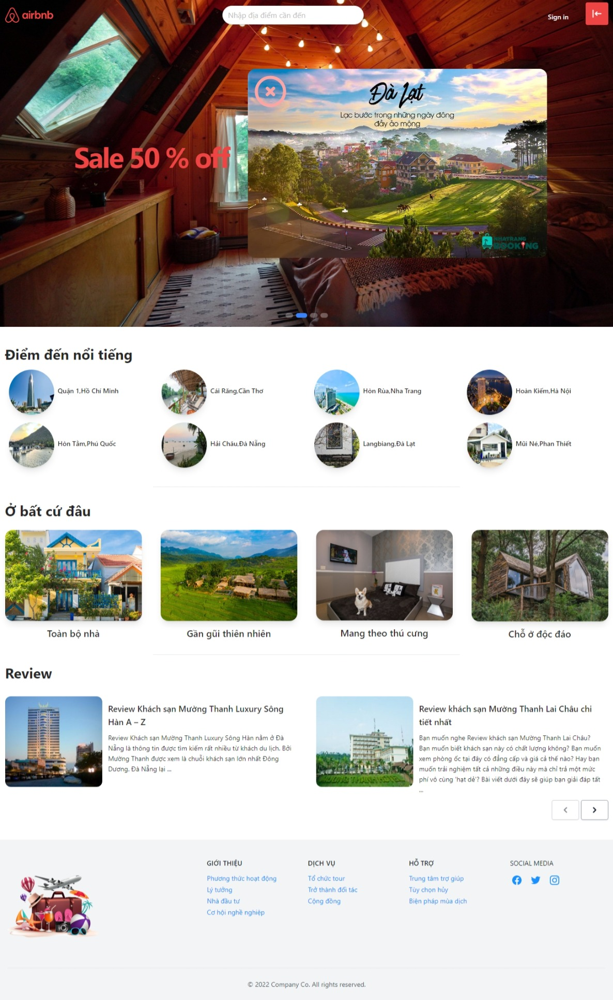

<div align="center">
  <a href="https://airbnb-sigma-three.vercel.app/">
    
  </a>
  <p align="center">
    <a href="https://airbnb-sigma-three.vercel.app/">View Demo</a>
  </p>
</div>

<br />

<div align="center">
  
  <a href="./src/Assets/HomePage.jpeg">HomePage</a>
  <a href="./src/Assets/DetailPage.jpeg">DetailPage</a>
  <a href="./src/Assets/RoomPage.jpeg">RoomPage</a>
  <a href="./src/Assets/UserPage.jpeg">PersonalPage</a>
  <a href="./src/Assets/AdminPage.jpeg">AdminPage</a>
</div>

## Install

In the project directory, you can run:

```sh
npm i
npm start
```

Open [http://localhost:3000](http://localhost:3000) to view it in your browser.

## Requests

-   Create an account or you can use
    adminAccount :
   lailanguyen@gmail.com/123
